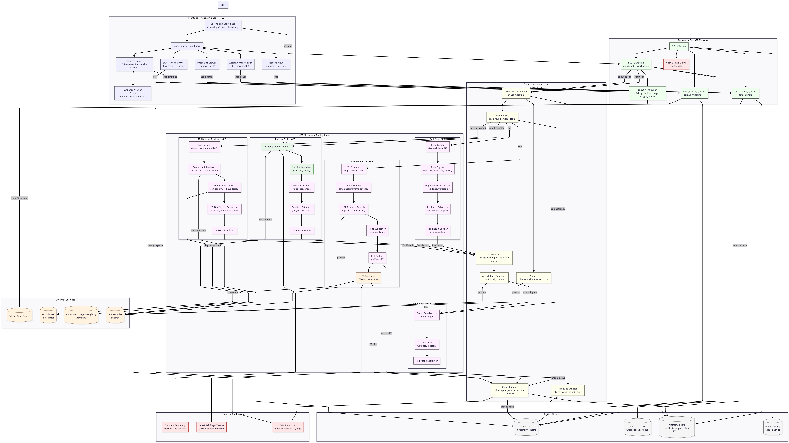
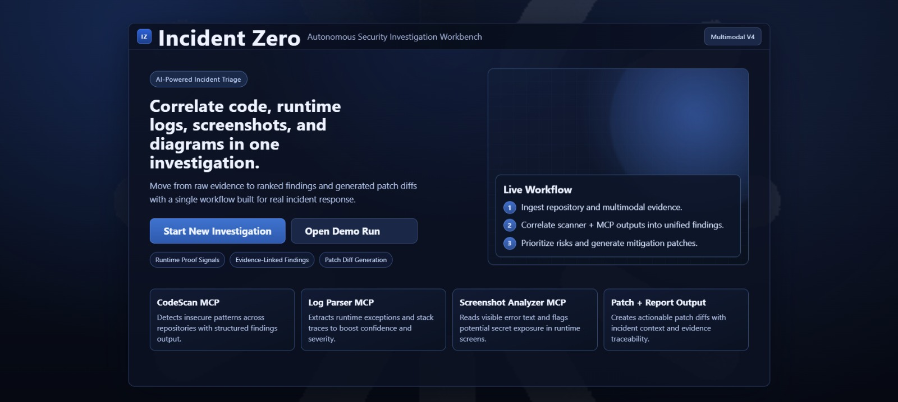
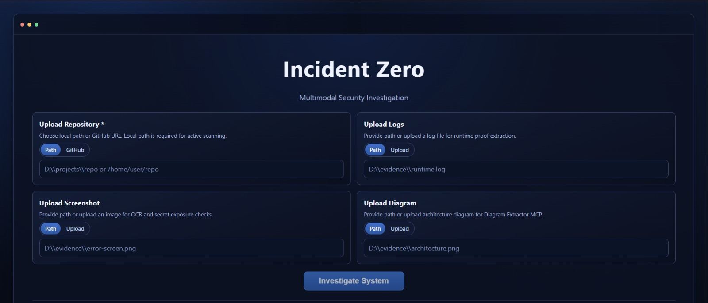
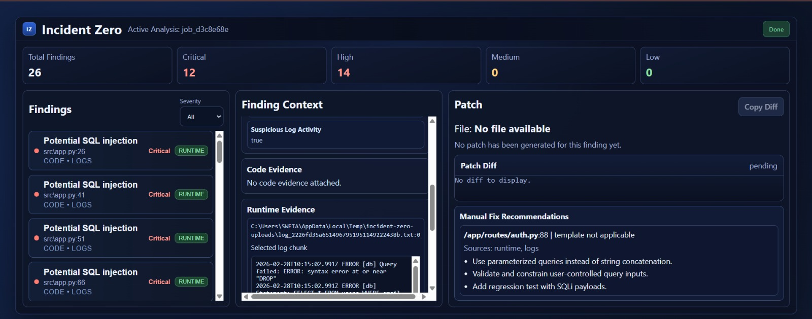
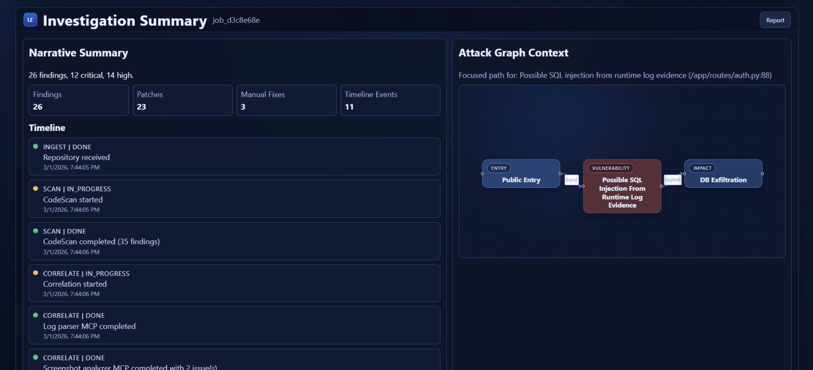
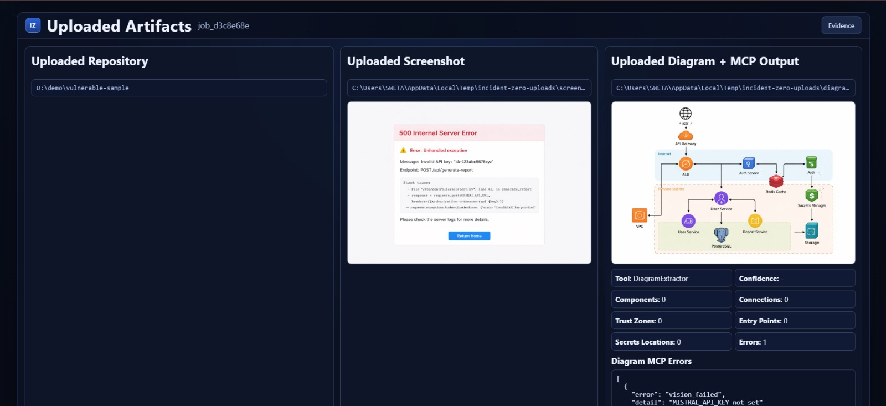

# 🔒 Incident Zero — Multimodal Autonomous Security Investigator

> **Autonomous, intelligent security incident investigation at your fingertips**

Incident Zero is a cutting-edge platform that automates security incident investigation by intelligently analyzing code, logs, diagrams, and screenshots. Powered by advanced AI models and Model Context Protocol (MCP) servers, it correlates diverse data sources to uncover attack vectors, generates intelligent security patches, and provides comprehensive incident reports.

---

## 📖 Use Case

Security teams face an overwhelming challenge: when a security incident occurs, they must manually investigate code repositories, parse cryptic log files, analyze system diagrams, and review screenshots—all while racing against time. This scattered, time-consuming process often misses critical connections between different evidence sources.

**Incident Zero transforms this chaos into clarity.**

Imagine a security incident in your production environment. Instead of your team spending hours sifting through logs and code:

- 🤖 **Automated Code Scanning**: Instantly identifies vulnerabilities in your codebase using advanced pattern matching and static analysis—hardcoded secrets, SQL injections, insecure configurations, and more
- 📊 **Intelligent Log Analysis**: Processes massive log files to extract error patterns, stack traces, and suspicious activities, providing context-aware insights into what went wrong
- 🎯 **Visual Intelligence**: Analyzes system diagrams and screenshots to understand infrastructure relationships and spot anomalies
- 🔗 **Smart Correlation**: Connects findings across all sources to build a holistic timeline of the incident progression

**The result?** What used to take days of investigation now happens in minutes, with AI-assisted accuracy and comprehensive evidence collection.

---

## 🏗️ Architecture



---

## 🔧 Model Context Protocol (MCP) Servers

Incident Zero leverages **5 specialized MCP servers**, each designed for specific aspects of security investigation:

### 1. **CodeScan** 🔍
**Purpose**: Static code analysis and vulnerability detection

**Functionality**:
- Scans repository codebases for common security vulnerabilities
- Detects hardcoded secrets, API keys, and credentials
- Identify SQL injection vulnerabilities and unsafe data handling
- Analyzes insecure configurations and dangerous code patterns
- Extracts evidence with file paths, line numbers, and severity ratings
- Outputs structured findings with confidence scores

**Output**: JSON findings with vulnerability metadata, code snippets, and remediation hints

---

### 2. **LogReasoner** 📋
**Purpose**: Intelligent log file analysis and event extraction

**Functionality**:
- Parses large log files (up to 5MB) from diverse sources
- Identifies error patterns, exceptions, and stack traces
- Extracts authentication failures, unauthorized access attempts, and suspicious activities
- Uses pattern recognition to flag potential SQL injection, path traversal, and other attacks
- Segments logs into meaningful chunks for LLM analysis
- Generates comprehensive summaries with root cause indicators
- Categorizes signals by severity and relevance

**Output**: Extracted log events, error timeline, and AI-generated insights about incident causes

---

### 3. **ScreenshotAnalyzer** 📸
**Purpose**: Visual analysis of system screenshots and UI captures

**Functionality**:
- Performs OCR on screenshots to extract text and information
- Analyzes UI elements to identify error messages or system states
- Detects visual indicators of security issues (error dialogs, warnings)
- Correlates visual context with other incident data
- Extracts readable text and system information from images

**Output**: OCR text, visual findings, and extracted system state information

---

### 4. **DiagramExtractor** 📐
**Purpose**: System architecture and infrastructure diagram analysis

**Functionality**:
- Analyzes system architecture diagrams to understand infrastructure topology
- Identifies component relationships and data flow paths
- Extracts architectural decisions that may relate to security posture
- Maps potential attack vectors based on system connections
- Correlates diagram components with findings from other sources

**Output**: Structured architecture data, component relationships, and topology insights

---

### 5. **Patcher** 🔧
**Purpose**: Automated security patch generation and deployment

**Functionality**:
- Generates deterministic, safe security patches for identified vulnerabilities
- Creates unified diffs for code changes needed to fix issues
- Supports hardcoded-secret and SQL-injection remediation
- Generates manual fix recommendations for unsupported vulnerability types
- Optionally creates GitHub pull requests with patches
- Provides comprehensive patch metadata and deployment guidance

**Output**: Formatted patches, PR bundles, and fix recommendations

---

## 🧠 AI Models

Incident Zero harnesses the power of **Mistral AI's latest models**:

| Model | Purpose | Use Case |
|-------|---------|----------|
| **mistral-large-latest** | Text analysis & reasoning | Log analysis, evidence correlation, root cause analysis |
| **mistral-vision-latest** | Vision & OCR capabilities | Screenshot analysis, diagram understanding, visual intelligence |
| **mistral-ocr-latest** | Optical character recognition | Text extraction from images, document analysis |

These models enable sophisticated understanding of incident data, context-aware analysis, and intelligent correlations.

---

## 🚀 Tech Stack

### **Backend**
- **Framework**: FastAPI 0.104.1 — Fast, modern Python web framework
- **Server**: Uvicorn 0.24.0 — ASGI server for high-performance async operations
- **Validation**: Pydantic 2.10.3 — Robust data validation using Python type hints
- **AI/ML**: MistralAI 1.6.0 — Access to Mistral's advanced language and vision models
- **Graphs**: NetworkX 3.1 — Building and analyzing correlation graphs
- **Testing**: Pytest 7.4.3, pytest-asyncio 0.21.1
- **Code Quality**: Black 23.12.0, Flake8 6.1.0, Mypy 1.7.1, Pylint 3.0.3
- **Utilities**: 
  - Python-dotenv 1.0.0 (environment configuration)
  - Requests 2.31.0 (HTTP requests)
  - Pillow 10.2.0 (image processing)

### **Frontend**
- **Framework**: Next.js 14.1.0 — React framework for production applications
- **UI Library**: React 18.2.0 — Modern declarative UI components
- **Visualization**: ReactFlow 11.11.4 — Interactive graph and diagram rendering
- **Language**: TypeScript 5.9.3 — Type-safe JavaScript development
- **Styling**: CSS3 with modern responsive design

### **Infrastructure**
- **API**: RESTful architecture with JSON payloads
- **Async Processing**: Background job processing for intensive analysis tasks
- **Storage**: File-based job store with upload directory management
- **CORS**: Multi-origin support for secure frontend communication

---

## 📄 Frontend Pages

Our intuitive, responsive interface guides users through the incident investigation process:

### Dashboard - Home Overview


### Upload & Data Collection


### Job Processing, Results, Findings & Analysis


### Interactive Attack Graph & Timeline


### Uploaded Artifacts


---

## 🚀 Getting Started

### Prerequisites
- Python 3.9+ (Backend)
- Node.js 18+ (Frontend)
- Mistral API Key (set `MISTRAL_API_KEY` environment variable)

### Installation

**Backend Setup**:
```bash
cd backend
pip install -r requirements.txt
```

**Frontend Setup**:
```bash
cd frontend
npm install
```

### Running the Application

**Start Backend**:
```bash
cd backend
python -m uvicorn app.main:app --reload --port 8000
```

**Start Frontend**:
```bash
cd frontend
npm run dev
```

Access the application at `http://localhost:3000`

---

## 👥 Team

| Role | Name | Email |
|------|------|-------|
| **Contributor** | Sweta Sahu | swetasahu2399@gmail.com |
| **Contributor** | Prajakta Patil | pprajakta1406@gmail.com |

---

## 📞 Support & Contributing

For issues, questions, or contributions, please open an issue or pull request in the repository.

---

## 📜 License

This project is licensed under the **MIT License** — see [LICENSE](LICENSE) file for details.

```
MIT License - Copyright (c) 2026 Sweta Sahu

You are free to use, modify, and distribute this software with proper attribution.
No warranty is provided; use at your own risk.
```
---

**Made with 🔒 Security in Mind**
